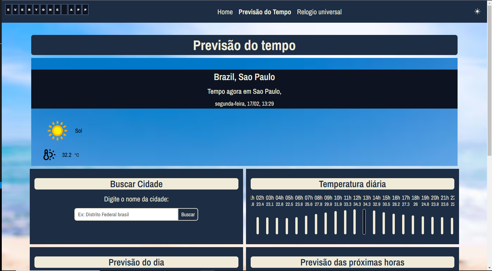
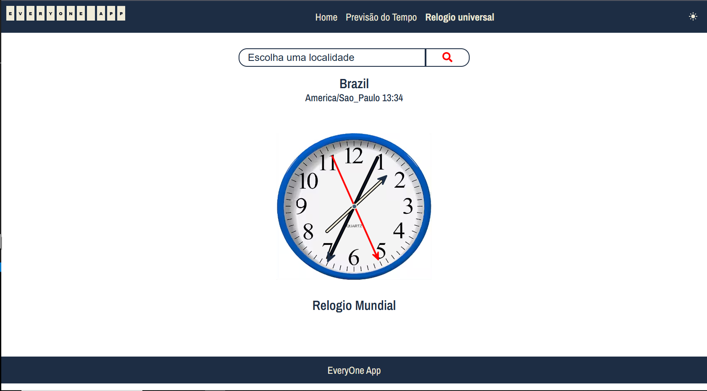

# EveryOne App
=====================================

**Resumo**
-----------

O EveryOne App é um aplicativo desenvolvido para fins didáticos, com o intuito de desenvolver pequenos aplicativos web.

## Recursos
------------

* **Previsão do Tempo**: O aplicativo usa a API [WeatherApi](https://www.weatherapi.com/) para buscas do clima conforme região.
* **Relógio Mundial**: O aplicativo usa a API [TimezoneDB](https://timezonedb.com/) para buscar por informações de horários locais no mundo todo.

### Imagens
------------

* 
* 

## Dependências
--------------

* [Vite](/READMEVITE.md) `^5.4.8`
* [TypeScript](https://www.typescriptlang.org/) `^5.6.3`
* [Styled-Components](https://styled-components.com/docs/api) `^6.1.13`

## Contribuição
--------------

Se você deseja contribuir com o projeto, por favor, leia o nosso [Guia de Contribuição](CONTRIBUTING.md).

## Exemplo de Uso
-----------------

Para usar o aplicativo, basta clonar o repositório e executar `npm install` e `npm run dev`.

## Instalação
-------------

Para instalar as dependências, execute o comando `npm install`.

Para subir a aplicação local, execute o comando `npm run dev`.

## Licença
-------

O EveryOne App é licenciado sob a licença MIT.

## Contato
-------

Se você tiver alguma dúvida ou precisar de ajuda, por favor, entre em contato conosco através do nosso [e-mail](leonardoluz10@hotmail.com).